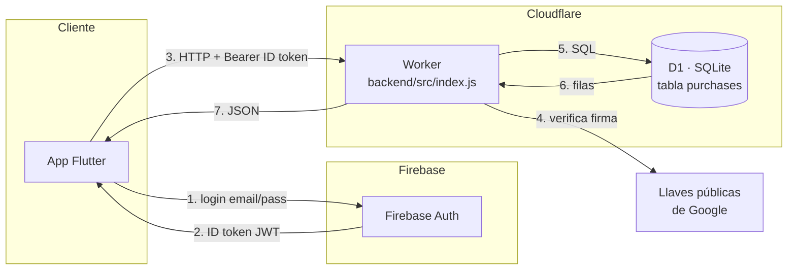

# 📱 Celphones Data Shop - Flutter Mobile App


Este repositorio público almacena el código de una aplicación móvil robusta y segura construida con **Flutter** para gestionar registros de compras de teléfonos móviles. Utiliza **Cloudflare Workers** con **SQLite (D1)** para el almacenamiento en el backend y **Firebase Authentication** para el inicio de sesión seguro de los usuarios.

## 🚀 Características

### Para Usuarios (App Flutter)
- **Autenticación Segura**: Inicio de sesión mediante email y contraseña usando Firebase Authentication.
- **Gestión de Compras**: Añadir, visualizar y listar registros completos de equipos con fotos y firmas.
- **Interfaz Moderna**: UI adaptativa y segmentada en secciones reutilizables.
- **Manejo de Errores**: Gestión elegante de errores de red y base de datos.

### Para Administradores (Cloudflare Workers)
- **Endpoints Seguros**: Validación de tokens JWT de Firebase en todas las rutas protegidas.
- **Base de Datos D1 (SQLite)**: Almacenamiento relacional rápido en el borde (edge).
- **Validación de Datos**: Asegura la integridad de los datos (IMEI únicos, asociación al `owner_uid`) antes de operaciones SQL.

## 🛠️ Stack Tecnológico

### Frontend
- **[Flutter](https://flutter.dev/)** - Toolkit de UI multiplataforma.
- **[Dart](https://dart.dev/)** - Lenguaje principal de Flutter.

### Backend
- **[Cloudflare Workers](https://workers.cloudflare.com/)** - Entorno de ejecución Serverless.
- **[SQLite (D1)](https://developers.cloudflare.com/d1/)** - Base de datos relacional de Cloudflare.

## 🗺️ Arquitectura

La aplicación sigue una arquitectura cliente-servidor segura:



## 🔧 Instrucciones de Configuración

### Requisitos Previos
- SDK de Flutter instalado.
- Node.js y npm instalados.
- Firebase CLI instalado (`npm install -g firebase-tools`).

### Paso 1: Configuración del Backend

1. **Entrar al directorio del backend e instalar dependencias**:
   ```bash
   cd backend
   npm install
   ```

2. **Crear la Base de Datos D1**:
   ```bash
   npx wrangler d1 create celphones
   ```
   Copia el **Database ID** resultante y pégalo en el archivo `backend/wrangler.toml`.

3. **Ejecutar migraciones (Esquema SQL)**:
   ```bash
   npx wrangler d1 execute celphones --local --file=./schema.sql
   ```

4. **Variables de Entorno**:
   - Edita el archivo `backend/wrangler.toml` para incluir tu `FIREBASE_PROJECT_ID`.
   - Crea un archivo `.dev.vars` dentro de `backend/` si necesitas almacenar claves secretas locales.

5. **Probar localmente**:
   ```bash
   npx wrangler dev
   ```

### Paso 2: Configuración del Frontend

1. **Ir al directorio principal de Flutter**:
   ```bash
   cd ../
   ```

2. **Instalar dependencias**:
   ```bash
   flutter pub get
   ```

3. **Configurar Firebase**:
   - Ejecuta `flutterfire configure` en la raíz del proyecto para enlazar tu proyecto de Firebase. Esto generará automáticamente `firebase_options.dart` y modificará `android/app/google-services.json` e `ios/Runner/GoogleService-Info.plist`.

4. **Ejecutar la App**:
   ```bash
   flutter run
   ```

## 📂 Estructura del Proyecto

```text
celphones_data_shop/
├── backend/                  # Backend en Cloudflare Workers
│   ├── src/index.js          # Lógica principal del Worker y validación de JWT
│   ├── schema.sql            # Esquema de la base de datos (tabla purchases)
│   └── wrangler.toml         # Configuración de Cloudflare
├── lib/
│   ├── main.dart             # Punto de entrada de la aplicación
│   ├── core/
│   │   ├── theme/            # Paleta de colores (app_colors.dart)
│   ├── models/               # Modelos de datos (purchase_model.dart)
│   ├── data/                 # Capa de datos y repositorios (purchase_store.dart)
│   ├── controllers/          # Lógica de estado (auth_controller, purchase_controller)
│   └── views/
│       ├── login_screen.dart              # Pantalla de Login
│       ├── main_layout_screen.dart        # Estructura principal con Drawer
│       ├── purchase_form_screen.dart      # Formulario para nuevas compras
│       ├── registered_devices_screen.dart # Listado de equipos
│       ├── device_detail_screen.dart      # Detalle visual del equipo
│       └── widgets/                       # Componentes reutilizables (Form sections, etc)
├── docs/                     # Archivos de contexto y documentación de arquitectura
├── android/ & ios/           # Configuración nativa y permisos (Info.plist)
└── README.md                 # Esta documentación
```

## 🔐 Permisos Nativos
La aplicación requiere permisos de acceso a la **Cámara** y la **Galería** para poder anexar las imágenes de los dispositivos comprados y los documentos de identidad.
- **iOS**: Configurado en `ios/Runner/Info.plist`.
- **Android**: Configurado en `android/app/src/main/AndroidManifest.xml`.
