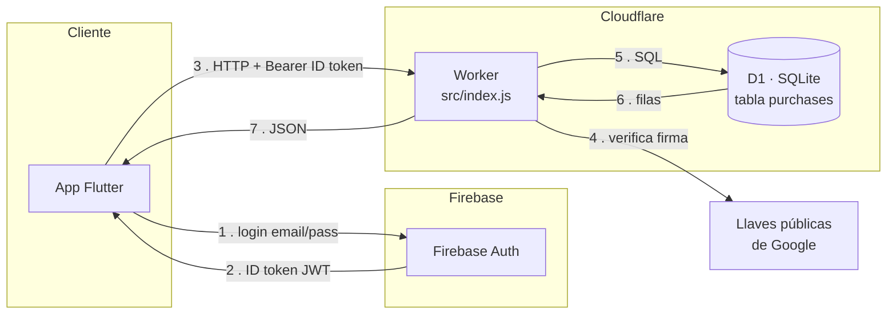
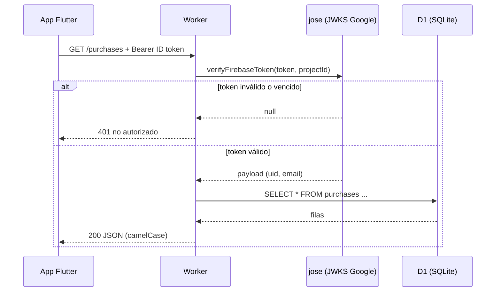

# Backend celphones — Cloudflare Worker + D1 (SQLite)

Tu API vive en un **Worker**; los datos en **D1** (SQLite de Cloudflare).
La app Flutter le pega por HTTP. **Pages no se usa** para el backend.

## Tecnologías

| Tecnología | Rol | Por qué |
|---|---|---|
| **Cloudflare Workers** | El backend/API (serverless) | Corre en el edge, sin servidor que mantener |
| **Cloudflare D1** | Base de datos (SQLite) | SQLite gestionado; simple y suficiente para esta escala |
| **Firebase Auth** | Login de usuarios | Facilidad de auth ya conocida; genera los ID token |
| **jose** | Verifica los JWT de Firebase en el Worker | Cripto correcta (RS256), sin hand-roll |
| **Wrangler** | CLI de deploy y dev local | Herramienta oficial de Cloudflare |
| **Flutter** | App cliente | Consume la API con el ID token en el header |

## Arquitectura



## Flujo de una petición



## Endpoints

| Método | Ruta | Qué hace |
|---|---|---|
| `GET` | `/purchases?q=texto` | Lista o busca (modelo, IMEI, serie, vendedor, cédula) |
| `POST` | `/purchases` | Crea una compra |
| `DELETE` | `/purchases/:id` | Borra una compra |

Todas exigen `Authorization: Bearer <ID token de Firebase>`.

## Pasos (una sola vez)

```bash
cd backend

# 1. Login en Cloudflare (abre el navegador)
npx wrangler login

# 2. Crear la base D1. Copia el database_id que imprime -> pégalo en wrangler.toml
npx wrangler d1 create celphones

# 3. Crear las tablas (local y remoto)
npx wrangler d1 execute celphones --file=schema.sql            # local (dev)
npx wrangler d1 execute celphones --file=schema.sql --remote   # en la nube

# 4. Poné tu Project ID de Firebase en wrangler.toml -> FIREBASE_PROJECT_ID
#    (consola de Firebase > Configuración del proyecto). No es secreto.
```

## Auth y aislamiento por usuario

La API exige un **ID token de Firebase** en `Authorization: Bearer <token>`.
Ese token lo genera la app Flutter con `firebase_auth` (`user.getIdToken()`).
El Worker lo verifica contra las llaves públicas de Google (no guardás secretos).

Cada compra guarda `owner_uid` = el uid del usuario logueado. **Todas** las
consultas filtran por ese uid, así que cada usuario solo ve, crea y borra sus
propios datos — sin choques entre usuarios. El cliente nunca decide el dueño;
lo pone el Worker desde el token verificado.

> Si ya habías creado la tabla sin `owner_uid`, migrá con:
> `wrangler d1 execute celphones --remote --command "ALTER TABLE purchases ADD COLUMN owner_uid TEXT NOT NULL DEFAULT ''"`

## Probar local

```bash
npx wrangler dev
# Necesitás un ID token real de un usuario logueado en tu app Flutter.
# Imprimilo con debugPrint(await user.getIdToken()) y pégalo aquí:
TOKEN="<ID_TOKEN_DE_FIREBASE>"
curl -H "Authorization: Bearer $TOKEN" \
  -H "content-type: application/json" \
  -d '{"sellerName":"Ana","imei":"123","pricePaid":500}' \
  http://localhost:8787/purchases

curl -H "Authorization: Bearer $TOKEN" http://localhost:8787/purchases
```

## Publicar

```bash
npx wrangler deploy
# Te da una URL: https://celphones-backend.<tu-cuenta>.workers.dev
```

Esa URL es la que pones en la app Flutter. El token de cada request lo
genera Firebase en el cliente (`user.getIdToken()`); no hay secreto compartido.
